<div align="center">

[](https://git.io/typing-svg)

<br/>


</div>

---

## 🙋‍♂️ About Me



```python
class DataScientist:
    name       = "Your Name"
    location   = "Patna, Bihar, India 🇮🇳"
    role       = "Future Data Scientist & AI Engineer"
    
    skills     = ["Python", "C", "C++", "Java", "DSA", "OOP"]
    passions   = ["EDA", "ML Pipelines", "LLMs", "Vector Search"]
    philosophy = "DIY · Build · Learn · Repeat"
    mission    = "Betterment of Humanity through Data"
    
    currently  = [
        "📊 Mastering EDA & Statistical Analysis",
        "🤖 Building LLM + RAG applications",
        "🧹 Cleaning the world's messy data",
        "🔬 Researching Vector Databases & CLIP",
    ]
    
    def predict_future(self, raw_data):
        cleaned   = self.clean(raw_data)
        features  = self.engineer(cleaned)
        model     = self.train(features)
        return model.predict("Tomorrow") 🚀
```

<br clear="right"/>

---

## 🛠️ Languages & Core Skills

<div align="center">

### 💻 Programming Languages
[](https://python.org)
[](https://en.wikipedia.org/wiki/C_(programming_language))
[](https://isocpp.org)
[](https://java.com)

### 🧠 Core CS Concepts


</div>

---

## 🔬 Data Science Expertise

<div align="center">

| 🔍 Area | 📋 What I Do |
|---|---|
| **Exploratory Data Analysis** | Statistical summaries, distribution plots, correlation heatmaps, outlier detection, hypothesis testing |
| **Data Visualization** | Interactive charts with Matplotlib & Seaborn, dashboards with Streamlit, insight-driven storytelling |
| **Data Cleaning** | Handling missing values, deduplication, type casting, noise removal, consistency checks |
| **Preprocessing** | Normalisation, encoding, feature scaling, train/test splits, pipeline construction |
| **Feature Engineering** | Creating meaningful features, dimensionality reduction, domain-driven transformations |

</div>

---

## ⚙️ Tools & Technologies

<div align="center">

### 📦 Data & ML Libraries
[](https://pandas.pydata.org)
[](https://numpy.org)
[](https://matplotlib.org)
[](https://pytorch.org)

### 🚀 Backend, Deployment & UI
[](https://fastapi.tiangolo.com)
[](https://docker.com)
[](https://streamlit.io)
[](https://microsoft.com/windows)

### 🤖 AI Platforms & Models


### 🗄️ Databases & IDEs
[](https://postgresql.org)
[](https://mysql.com)

[](https://figma.com)


</div>

---

## 📂 Featured Repositories

<div align="center">

| 📁 Repository | 🔤 Language | 📝 Description |
|---|---|---|
| [**Python-Projects-**](https://github.com/YOUR_GITHUB_USERNAME/Python-Projects-) |  | A comprehensive collection of Python projects centred on real-world **data analytics** — EDA workflows, visualisation exercises, and statistical exploration |
| [**Exercism-Solutions**](https://github.com/YOUR_GITHUB_USERNAME/Exercism-Solutions) |  | Clean, idiomatic solutions to **Exercism challenges** — demonstrating Pythonic coding discipline, algorithmic thinking and mastery of language fundamentals |
| [**AI\_projects**](https://github.com/YOUR_GITHUB_USERNAME/AI_projects) |  | **Industry-grade scalable AI projects** — ML pipelines, model training & evaluation, LLM API integration, vector search using Qdrant + LangChain + CLIP |
| [**C---Programming**](https://github.com/YOUR_GITHUB_USERNAME/C---Programming) |  | Deep-dive into **C language fundamentals** — pointers, memory management, data structures, algorithmic problem solving. The bedrock of systems thinking |
| [**Excel-Practice-Excersies**](https://github.com/YOUR_GITHUB_USERNAME/Excel-Practice-Excersies) |  | Hands-on **Google Sheets exercises** — pivot tables, formulas, business analytics and data manipulation bridging manual analysis and code-based workflows |
| [**Working-With-Data**](https://github.com/YOUR_GITHUB_USERNAME/Working-With-Data) |  | Foundational data science notebook — **data collection, cleaning, preprocessing pipelines** and extraction using Pandas, NumPy and Matplotlib |

</div>

---

## 📊 GitHub Statistics

<div align="center">


<br/>


</div>

---

## 🏆 GitHub Trophies

<div align="center">

[](https://github.com/ryo-ma/github-profile-trophy)

</div>

---

## 💡 Activity Graph

<div align="center">

[](https://github.com/ashutosh00710/github-readme-activity-graph)

</div>

---

## 📝 A Note to the World

<div align="center">

> _"I am on a relentless journey of learning **high-end, industry-grade skills** — not because someone told me to, but because I genuinely believe that **data is the most powerful raw material of our era**. Every dataset is a question waiting to be answered; every model, a glimpse into the future._
>
> _I am a **DIY builder** at heart: if I don't understand something, I take it apart and rebuild it from scratch. My ultimate mission is **simple but enormous** — to use data, AI, and technology to better understand the world around us, predict what comes next, and create solutions that uplift humanity._
>
> _The future is not just something that happens to us — **it's something we can engineer, if we're willing to look hard enough at the numbers.**"_

<br/>


</div>

---

<div align="center">

**🌐 Connect & Collaborate**

[](https://linkedin.com/in/YOUR_LINKEDIN)
[](https://github.com/YOUR_GITHUB_USERNAME)
[](mailto:YOUR_EMAIL)

</div>


